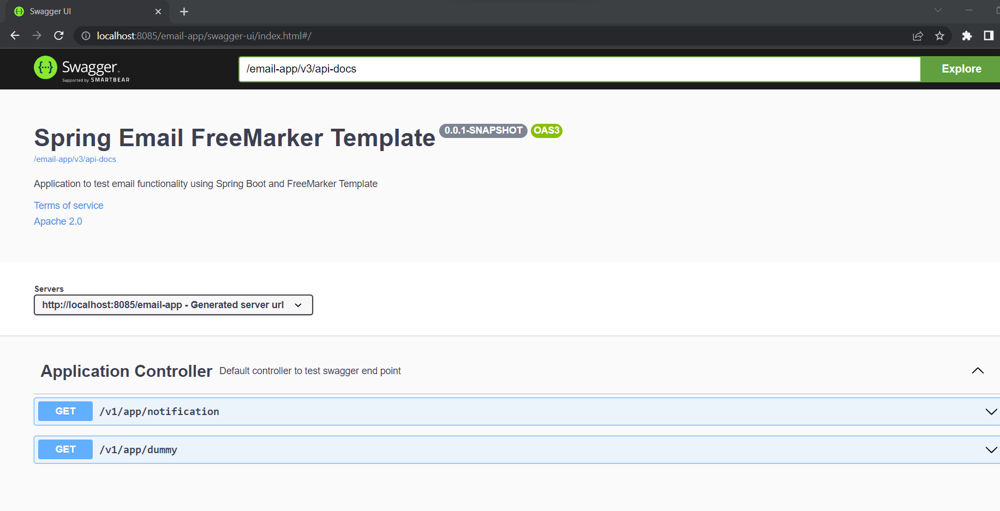

# Email FreeMarker Template
Application to test email functionality using Spring Boot and FreeMarker Template.

# Prerequisite
Before running application installed below software

* Java
* Maven

# How to run application
To run application execute below commands in command prompt
* git clone https://github.com/amit02543/email-freemarker.git
* cd email-freemarker
* mvn clean install
* mvn spring-boot:run
* Open http://localhost:8080/template-app/swagger-ui.html in browser tab
* Execute **notification api** in **application controller**

 

 

 

# Generate App Password

To generate application specific password in gmail follow below steps

1. Go to **security** tab in your Google account
2. Click on **App Passwords**
3. On **App Password** page, select **Custom** option 
4. Provide application name and click on generate

 

 

 